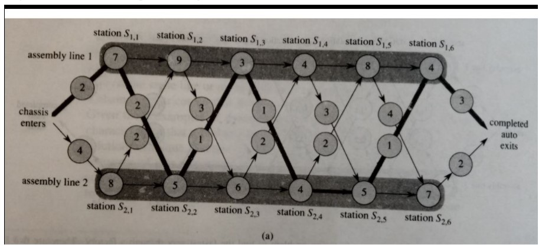

# Problem 1​:
Write a program that solves the assembly line problem with arbitrary number of assembly lines(similar to the 2-assembly line problem given in CLRS in the dynamic programming section).
1. Here there are ​N​ assembly lines in the factory, that exist on the factory floor placed inorder.
2. Each assembly line has ​M​ stations.
3. There is an entry time and exit time defined for each assembly line.
4. Each station on an assembly line has a processing time.
5. Transfers are allowed only between adjacent lines from the ith station to  the (i+1)thstation.(For example from the 2nd station on the 4th assembly line we can only move to the 3rd station on the 3rd, 4th, or 5th assembly line)
6. For more details refer to the assembly line problem described in CLRS.
## Input format:
- The first line consists of N and then M.
- Then the next N lines consist of M+2 integers each where each line represents the entry time, exit time and then the list of  processing times for the M stations for each assemblyline.
- Then the 2(N-1) lines contain M-1 integers each.
- The first line in the ith pair of lines represent the list of transfer times of the stations from ith assembly line to (i+1)th assembly line, while the second line of the ith pair represents the list of transfer times of the stations from the (i+1)th assembly line to the ith line.
### Input example:
> 2 6  
> 2 3 7 9 3 4 8 4  
> 4 2 8 5 6 4 5 7  
> 2 3 1 3 4  
> 2 1 2 2 1  

Represents the following assembly line

## Output format:
- Integer that represents the minimum time required to go through the assembly lines.
- The next M lines should contain the assembly lines visited to take the shortest time throughthe assembly lines.
### Output Example:
For the given input example  
> 38  
> 1  
> 2  
> 1  
> 2  
> 2  
> 1  

### Another input and output example with more than 2 assembly lines
#### Input​:
> 3 5  
> 1 2 6 1 1 1 6  
> 3 1 3 3 3 3 3  
> 1 3 1 2 3 4 5  
> 1 1 2 1  
> 1 1 1 1  
> 2 1 1 1  
> 1 1 3 1  
#### Output​:  
> 14  
> 3  
> 2  
> 1  
> 1  
> 2  

# Problem 2​:
You are playing a game where you can stand to win a lot of money. The rules of the game are as follows:
1. You will be given an arithmetic expression with digits separated by operators + and *
2. You need to place brackets around the operands in a way that will maximize the expression to win the full amount.
3. If the value you obtained is not the maximum value of the expression, you will be given money corresponding to the minimum value that can be obtained from the expression by placing brackets around the operands.
Write a program to find out the maximum amount of money that you can win as well as the minimum amount.
## Input format:
- The first line of input contains the number of test cases k ( k< 5000 ).
- Each of the following k lines consists of an arithmetic expression. This expression consists of numbers (0-9)separated by one of the two operators '*' and '+'.
- There are no spaces between the characters. Each line contains less than 100 characters.
### Input example:
> 1+2\*3+4\*5
## Output format:
- For each expression output the result obtained for the maximum amount and the result obtained for the minimum amount separated by one space.
- The results of the calculationsare smaller than 2^64
### Output Example:
> 105 27
## Explanation:
105 = (1+2)\*(3+4)\*5  
27  = 1+2\*3+4\*5  

